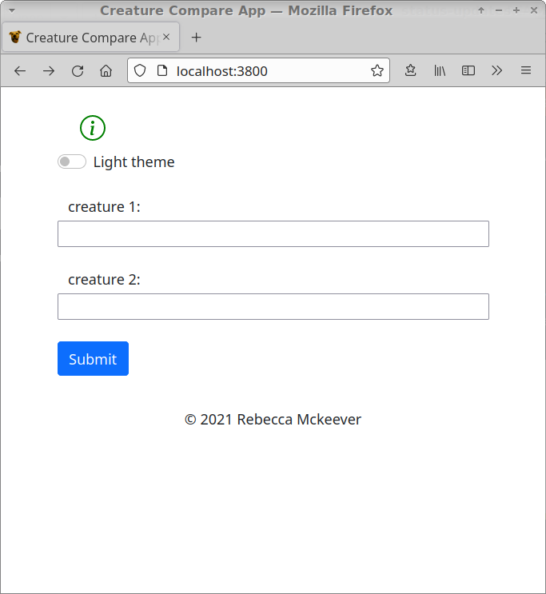
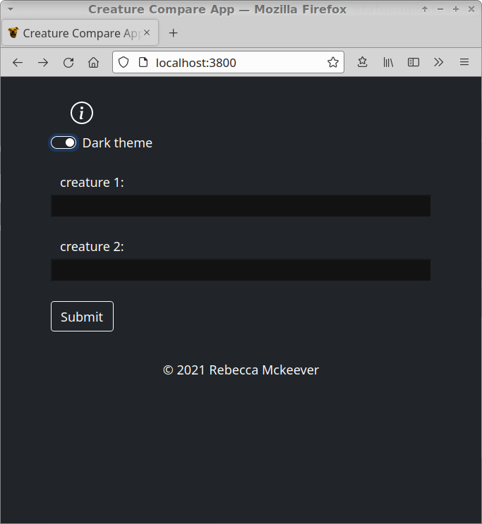
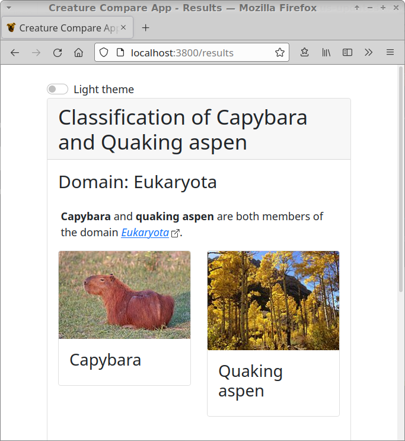
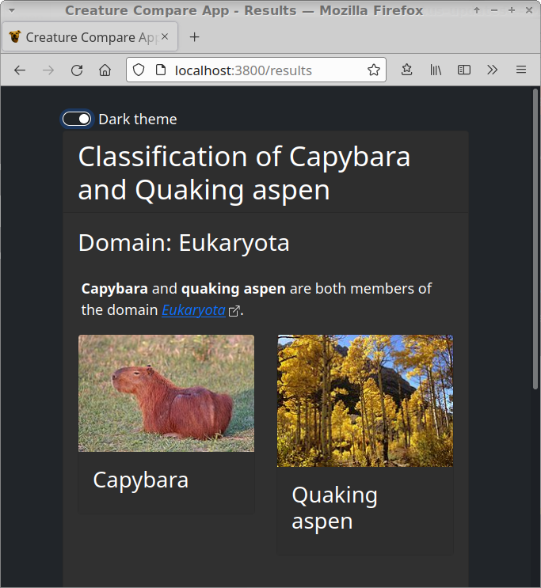
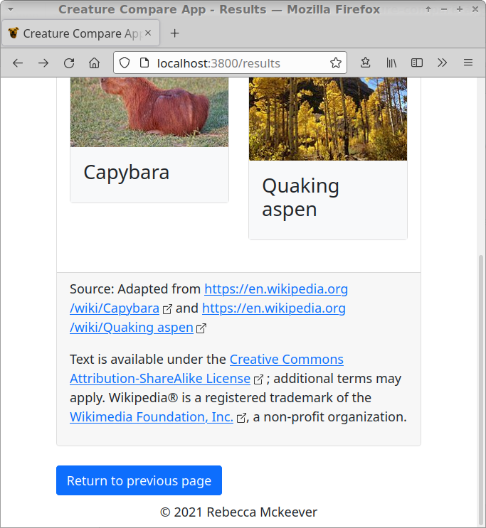
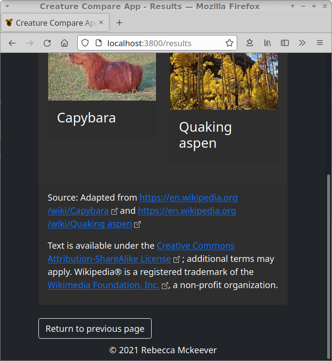

Creature Compare App
=======

Using
-----------

Type in the name of a different living organism in each box to learn the most specific taxonomy category that includes both. You can also double click inside either of the text boxes for a list of suggestions. As you type, possible matches will drop down below the textbox. Note that you are not limited to the suggested organisms.

Use the theme switch to toggle the colors of the page between `Dark theme` and `Light theme`. The label next to the switch displays the currently active theme. Currently, the theme resets to `Light theme` when the results page loads or if you refresh the page.

Note that, despite the use of the term "creature", the organism can be any [Animalia](https://species.wikimedia.org/wiki/Animalia), [Plantae](https://species.wikimedia.org/wiki/Plantae), [Fungi](https://species.wikimedia.org/wiki/Fungi), [Bacteria](https://species.wikimedia.org/wiki/Bacteria), [Archaea](https://species.wikimedia.org/wiki/Archaea), or [Protista](https://species.wikimedia.org/wiki/Protista). 

|  |  |
| ------------- | ------------- |
|   |   |
|   |   |
|   |   |

Installing and running with localhost
-----------

To install, clone/download the files and navigate to the folder where you saved the files, and run

    npm install

to install the required modules. To start the app, run

    node app.js
    
and then navigate to `http://localhost:3800/` in your browser. For best results, use Firefox or Chrome/Chromium.

Starting the services
-----------

Clone/download the [HTML-Scraper](https://github.com/lsendlein/HTML-Scraper) and the [ImageScraper](https://github.com/SaphiraSkies/ImageScraper). Install the dependencies needed as described on their README pages. 

Navigate to the folder where you saved HTML-Scraper. Open a new terminal and run

    node server.js

Navigate to the folder where you saved ImageScraper. Open a new terminal and run

    python3 ws_server.py
    
Note that the app will work without the ImageScraper, but there won't be images on the results page. Without the HTML-Scraper, you will see an error page if you submit the form.

 
